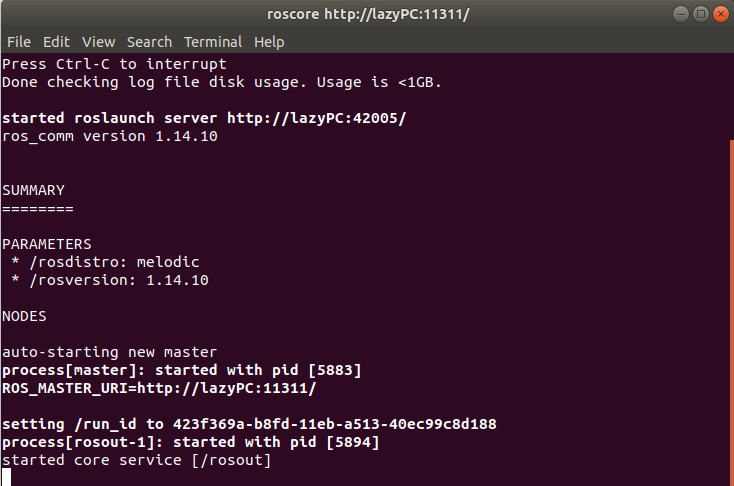

# 🏎AIFFEL 대전 1기 자율주행 프로젝트🏎
자율주행, 협동로봇 플랫폼을 제공하는 기업 위고 코리아와 협업한 프로젝트 [위고코리아 홈페이지](https://wego-robotics.com/)

## 1. 팀명: We-Go
## 2. 일정: 2021.05.10 ~ 2021.06.18 (약 6주)
## 3. 팀원: 양창원(팀장), 김강태, 임진선, 안석현, 문재윤
## 4. 목표: 실내 자율주행 모바일 로봇이 특정 인물을 Tracking 할 수 있는 기능 구현
## 5. 역할
|역할|main|sub|
|---|---|---|
|Tracking(Siam)|김강태|-|
|Tracking(DeepSORT)|양창원|-|
|depth camera|안석현|김강태|
|ROS|문재윤|양창원|
|H/W|문재윤|임진선|
|Recording|임진선|-|

### [프로젝트 진행 Notion](https://www.notion.so/We-Go-ed512708c2f14177a53e4f5c95d918a9)

# Code 사용 방법
## 설치(Installation)
1. ROS  
2. scout-mini  
3. yolov4-deepsort  

## 1. ROS 설치 & workspace init
1) [ROS 설치 링크](http://wiki.ros.org/melodic/Installation/Ubuntu)로 이동  
2) ROS Melodic(Ubuntu 18.04 호환 버전) 설치  
3) update까지 마치고 desktop-full 실행  
`$ sudo apt install ros-melodic-desktop-full`  
4) 1.6.1까지 진행  
5) 설치 후 터미널에서 `roscore` 실행으로 정상적으로 설치되었는지 확인  

  

참고) ROS Melodic에서 Python3를 사용하기 위해서는 아래 명령어 입력 필요  
`$ sudo apt-get install python3-catkin-pkg-modules`  
`$ sudo apt-get install python3-rospkg-modules`

6) 터미널 창에서 아래와 같이 작업 공간(폴더)를 생성한다. (catkin_ws 이외에 다른 폴더 이름을 해도 상관없다.)  
`$ cd ~ && mkdir -p catkin_ws/src`  
`$ cd ~/catkin_ws/src`  
7) workspace init 실시  
`$ catkin_init_workspace`  

## 2. scout-mini, yolov4-deepsort 설치  
1) 위 내용과 이어짐. scout-mini github code를 clone해야 한다. ROS workspace init한 상태에서 바로 진행한다.  
`$ git clone https://github.com/We-Go-Autonomous-driving/main2_one_person.git`  
2) 새로운 패키지(폴더)를 설치하면 catkin_make를 해줘야 한다.(상위 폴더에서 해야함)  
`$ cd .. && catkin_make`  

참고) Python 파일을 새로 생성한 후에는 해당 파일의 권한 설정이 필요하다.  
`$ sudo chmod +x (파일이름)`  
또는 모든 파일에 대해서 한 번에 할 때는 아래와 같은 명령어 사용  
`$ sudo chmod +x ./*`  

여기까지 하면 scout-mini를 제어할 수 있는 단계가 된다.  

yolov4-deepsort를 사용하기 위해서는 [yolov4.weights](https://drive.google.com/open?id=1cewMfusmPjYWbrnuJRuKhPMwRe_b9PaT) 를 다운받거나 혹은 [yolov4-tiny.weights](https://github.com/AlexeyAB/darknet/releases/download/darknet_yolo_v4_pre/yolov4-tiny.weights)를 다운받아야 한다. 그리고 `weights`파일을 `scout_bringup/data`경로에 넣어줘야 함.

또한 아래 명령어를 실행해서 darknet weights를 Tensorflow model에 사용할 수 있게 convert해야 함.  
`$ python save_model.py --model yolov4` (yolov4.weights 사용)  
`$ python save_model.py --weights ./data/yolov4-tiny.weights --output ./checkpoints/yolov4-tiny-416 --model yolov4 --tiny` (yolov4-tiny.weights 사용)  

yolov4-deepsort에 대해 더 자세히 알고 싶다면 [여기](https://github.com/theAIGuysCode/yolov4-deepsort) 참고할 것  
scout-mini에 대해 더 자세히 알고 싶다면 [여기](ttps://github.com/agilexrobotics/scout_mini_ros) 침고할 것  

## 3. 최종 경로(요약)  
catkin_ws(폴더 이름은 변경 가능)  
├build  
├devel/setup.bash  
└src  
　└scout_mini_ros  
　　└scout_bringup  
　　　├core  
　　　├data/yolov4.weights(or yolov4-tiny.weights)  
　　　├deep_sort  
　　　├launch  
　　　├model_data  
　　　├outputs  
　　　├scripts  
　　　├tools  
　　　├Default_dist.py --> 깊이 초깃값 측정 (이를 토대로 장애물 영역의 깊이를 측정해 장애물 유무를 판단할 수 있다.)    
　　　├camera.py --> depth camera를 이용할 수 있게 하는 class code  
　　　├convert_tflite.py  
　　　├convert_trt.py  
　　　├drive.py --> 입력 이미지에 대한 주행 알고리즘(depth값과 RGB값이 입력되어 전진/정지/우회전/좌회전/속도감속 등을 정한다)    
　　　├key_move.py --> 추적 & 주행 알고리즘을 거쳐 나온 결과값(string)에 따라 속도와 방향을 변경해주는 메소드    
　　　├object_track_one_person.py --> 입력 이미지에 대한 추적 실시  
　　　├save_model.py  
　　　├scout_motor_light_pub.py --> key_move.py에서 나온 결과를 ROS topic으로 발행하는 코드(모터 및 조명 제어)  
　　　└utils2.py --> 깊이값을 이용해 사람과의 거리 및 장애물 영역 측정    
   
## 4. 사용 방법
- `scout_bringup/object_track_one_person.py` 를 rosrun 하면 된다.
1. $ cd catkin_ws/src && source devel/setup/bash  
2. $ roslaunch scout_bringup scout_minimal.launch  
3. 새로운 터미널 열기
4. $ cd catkin_ws/src && source devel/setup/bash  
5. $ rosrun scout_bringup object_track_one_person.py

--> 시작 시 최초1인을 추적하는 코드

## 5. 모듈 파일 설명(scout_bringup 폴더 내에 있음)
1. key_move.py --> 추적 & 주행 알고리즘을 거쳐 나온 결과값(string)에 따라 속도와 방향을 변경해주는 메소드  
2. scout_motor_light_pub.py --> key_move.py에서 나온 결과를 ROS topic으로 발행하는 코드(모터 및 조명 제어)  
3. camera.py --> depth camera를 이용할 수 있게 하는 class code  
4. drive.py --> 입력 이미지에 대한 주행 알고리즘(depth값과 RGB값이 입력되어 전진/정지/우회전/좌회전/속도감속 등을 정한다)  
5. utils2.py --> 깊이값을 이용해 사람과의 거리 및 장애물 영역 측정  
6. Default_dist.py --> 깊이 초깃값 측정 (이를 토대로 장애물 영역의 깊이를 측정해 장애물 유무를 판단할 수 있다.)  
7. object_track_one_person.py --> 입력 이미지에 대한 추적 실시  

**참고**   
작성된 code는 2가지 버전이 있으니 유의할 것.  

현재 저장소에 작성된 코드는 main code2이며, 초기에 탐지된 1인을 추적하며, target lost가 되면 조명이 blink되어 상태를 알려줄 수 있고 재인식이 가능하다.  
main code1는 넥타이를 착용한 1인을 추적하는 코드이다.   
